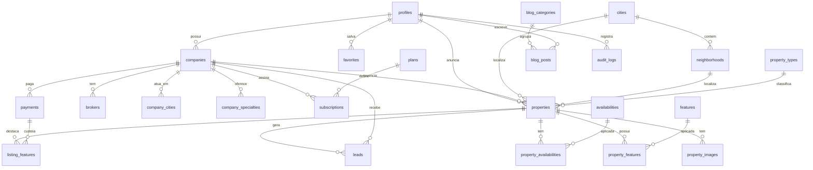

# 77Imóveis — Banco de Dados e ERD

Banco PostgreSQL (Supabase). Scripts em `/database`: `01_schema.sql` → `02_rls.sql` → `03_seed.sql`.

## 1. Princípios

- **Normalização**: tipos de imóvel, disponibilidades, características, cidades, bairros e especialidades são tabelas de catálogo (N:N onde aplicável).
- **Segurança por linha (RLS)** em todas as tabelas; conteúdo público legível, escrita só do dono, admin total.
- **Geo**: coluna `geom` (PostGIS) sincronizada por trigger a partir de lat/lng — busca por raio no mapa.
- **Autocomplete**: índices trigram (`pg_trgm`) em `cities.name` e `neighborhoods.name`.
- **Slugs** únicos e amigáveis para SEO.

## 2. Diagrama de Entidade-Relacionamento (ERD)



## 3. Tabelas (resumo)

**Localização** — `cities`, `neighborhoods` (slug, lat/lng, geom, SEO).
**Pessoas/empresas** — `profiles` (estende auth.users), `companies`, `brokers`, `company_cities`, `specialties`, `company_specialties`.
**Catálogo** — `property_types`, `availabilities`, `features`.
**Imóveis** — `properties`, `property_images`, `property_features`, `property_availabilities`, `favorites`.
**Leads** — `leads`.
**Monetização** — `plans`, `subscriptions`, `payments`, `listing_features`, `coupons`, `banners`.
**CMS/SEO** — `blog_categories`, `blog_posts`, `seo_pages`.
**Admin** — `moderation_queue`, `audit_logs`, `site_settings`.

## 4. Regras garantidas no banco (triggers)

| Trigger | O que faz |
|---|---|
| `handle_new_user` | Cria `profiles` quando alguém se cadastra (papel `particular`). |
| `enforce_particular_limit` | Bloqueia o 2º imóvel ativo de um `particular` → app oferece migração B2B. |
| `sync_geom` | Mantém `geom` a partir de lat/lng (cidades, bairros, imóveis). |
| `bump_leads_count` | Incrementa `leads_count` no imóvel a cada novo lead. |
| `set_updated_at` | Atualiza `updated_at` automaticamente. |

## 5. Funções úteis

- `properties_within_radius(lat, lng, km)` → imóveis ativos dentro de um raio (mapa).
- `auth_role()` / `is_admin()` → usadas nas políticas RLS.

## 6. Exemplos de consulta

```sql
-- Autocomplete de cidade
select name, slug from cities
where name ilike unaccent('%conqui%') order by is_featured desc limit 8;

-- Busca: casas à venda em VC, 3+ quartos, até 500 mil, com piscina
select p.* from properties p
join cities c on c.id = p.city_id
join property_types t on t.id = p.property_type_id
where p.status='ativo' and c.slug='vitoria-da-conquista'
  and t.slug='casa' and p.negotiation='venda'
  and p.bedrooms >= 3 and p.price <= 500000
  and exists (select 1 from property_features pf
              join features f on f.id=pf.feature_id
              where pf.property_id=p.id and f.slug='piscina')
order by p.is_featured desc, p.published_at desc;
```

## 7. Índices principais

slug (cidades/bairros/empresas/imóveis), trigram (nome cidade/bairro), GiST (geom), FTS português (título+descrição), e índices por status/cidade/tipo/preço para a busca.
